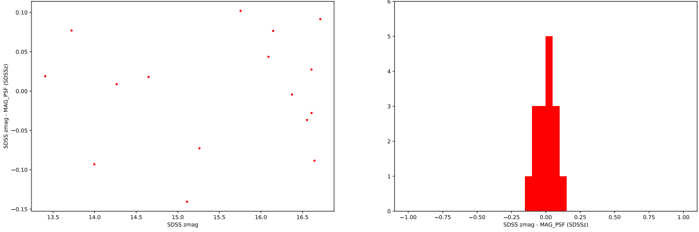

Results
*******

Catalogs
========

CFC produces three types of catalogs:

SExtractor catalogs in plane text format with (.cat) termination.

CFC catalogs with informaton about diffrent parameters of each accepted source in the image.

CFC catalogs with informaton about diffrent parameters of each source (accepted sources and saturated or artifacts) in the image. This catalogs are named with the suffix sources.

The catalogs parameters are:

==================  =======================================================================================================================================================================================================
Parameter           Description
------------------  -------------------------------------------------------------------------------------------------------------------------------------------------------------------------------------------------------
*Image_identifier*  Image identifier in CAHA archives
*Detection_ID*      Object identifier in catalog
*MJD*               Modified Julian Date of image
*SNR_WIN*           signal-noise ratio
*RAJ2000*           Right ascension in degrees
*DEJ2000*           Declination in degrees
*e_RAJ2000*         Uncertainty of right ascension in degrees
*e_DEJ2000*         Uncertainty of declination in degrees
*RA_hms*            Right ascension in hh:mm:ss format
*DE_dms*            Declination in dd:mm:ss format
*MAG*               Calibrated magnitude
*e_MAG*             Uncertainty in calibrated magnitude
*MAG_sex*           SExtractor magnitude
*e_MAG_sex*         Uncertainty in SExtractor magnitude
*cl_SDSS*           SDSS class, only for object in SDSS field
*SPREAD_MODEL*      Value of Sextractor SPREAD_MODEL
*flag_calib*        flag of the calibration curve, if the value is A, the magnitude of the object is within the calibration curve, if it is B it is less and if it is C it is greater than the calibration curve magnitudes
*Filter*            Filter of the image
*Elongation*        Value of the object elongation
*FWHM*              Value of the object Full Weight half maximum
*source_type*       Type of object between accepted, saturated and artifacts (only for _sources catalogs).
*FLAGS*             The FLAGS value obtained by SExtractor.
*FLAGS_WEIGHT*      The FLAGS_WEIGHT value obtained by SExtractor.
==================  =======================================================================================================================================================================================================

Figures
=======

CFC returns some figures about the calibration process for each image.

These figures are:

The FLUX_MAX vs FLUX_PSF curve (shown in previous section) where the saturated sources have red color, rejected sources with a excessively large FLUX_MAX/FLUX_PSF relation have blue color, accepted sources as real sources well measured have green color.

The SDSS magnitude vs MAG_SEX curve with the calibration relation (shown in previous section), sources with bad morphology parameters have black color, sources excluded by a sigma clipping or without class=6 & qmode=1 if the is in SDSS field have blue color, accepted sources for the calibration have red color.

The SDSS magnitude substracted by calibrated magnitude vs SDSS magnitude scatter plot and histogram.

   ..

   fig. 4 Example of figure about SDSS magnitude substracted by calibrated magnitude vs SDSS magnitude. Left: scatter plot. Right: histogram.

Logout
======

CFC produces a data table with the calibration parameters for each image and if its image was calibretad or rejected because its Pearson r parameter was lower than 0.98.

These calibration parameters are:

===================  ==========================================================================================
Parameter            Description
-------------------  ------------------------------------------------------------------------------------------
*Image name*         Name of the image
*number of sources*  Number of sources used for the calibration
*Reference catalog*  Catalog used to calibrate magnitudes, it can be SDSS or APASS
*A*                  Zeropoint of the calibration curve in magnitudes
*e_A*                Uncertainty of the zeropoint of the calibration curve in magnitudes
*B*                  Slope of the calibration curve
*e_B*                Uncertainty of the slope of the calibration curve
*r*                  Pearson correlation coefficient
*Status*             Status of the image, if the status is calibrated a corresponding catalog was maked
*Reason*             Reason for the rejection of the catalog, if the status is calibrated the box will be empty
===================  ==========================================================================================
